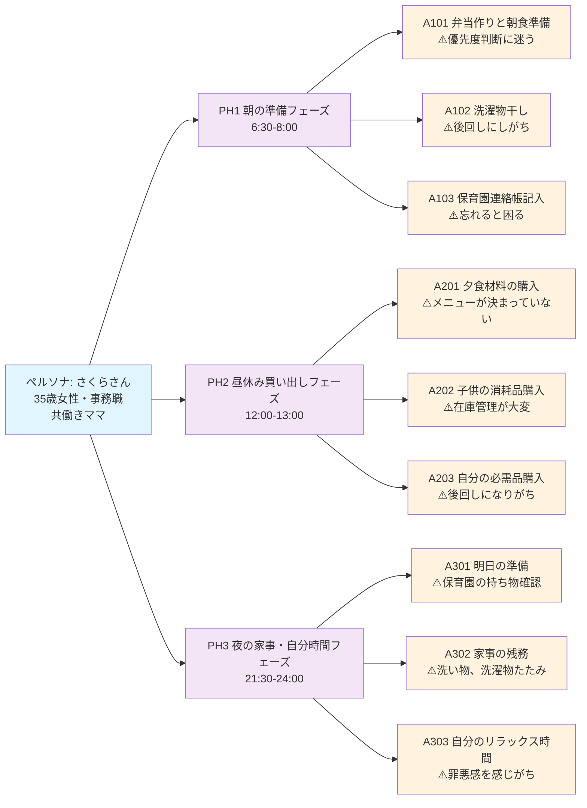

# 体験マップ（Mermaid図）

## 体験マップの読み方

### フェーズ別の課題
- **PH1（朝の準備）**: 時間制約の中での優先度判断
- **PH2（昼休み買い出し）**: 効率的な買い物ルートと在庫管理
- **PH3（夜の家事・自分時間）**: 家事と自分時間のバランス

### 共通する課題パターン
1. **優先度判断の迷い**: 複数のタスクから何を先にやるか決められない
2. **在庫・状況把握**: 冷蔵庫の中身、子供の消耗品残量などの把握
3. **罪悪感・後回し**: 自分のことを後回しにしてしまう傾向

### 次のステップ
この体験マップを基に、課題定義フェーズで具体的な問題を深掘りしていきます。
