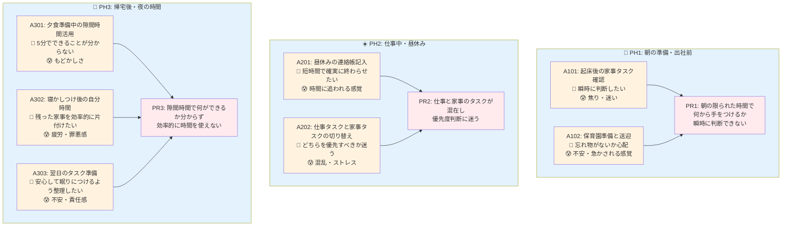

# 顧客課題マップ（提案版）

## 課題の詳細分析

### PR1: 朝の時間管理課題
- **発生フェーズ**: 朝の準備・出社前（6:30-8:00）
- **関連行動**: 家事タスク確認、保育園準備
- **感情**: 焦り、迷い、不安
- **根本原因**: 
  - タスクの優先度が不明確
  - 時間制約がきつい
  - ルーティン化されていない

### PR2: 仕事・家事混在課題
- **発生フェーズ**: 仕事中・昼休み（12:00-13:00）
- **関連行動**: 連絡帳記入、タスク切り替え
- **感情**: 混乱、ストレス、時間に追われる感覚
- **根本原因**:
  - コンテキストスイッチのコスト
  - 異なる種類のタスクの管理方法が統一されていない

### PR3: 隙間時間活用課題
- **発生フェーズ**: 帰宅後・夜の時間（19:00-24:00）
- **関連行動**: 夕食準備中、自分時間、翌日準備
- **感情**: もどかしさ、疲労、罪悪感、不安
- **根本原因**:
  - 短時間でできるタスクの把握不足
  - 時間の見積もりが不正確
  - 自分時間への罪悪感