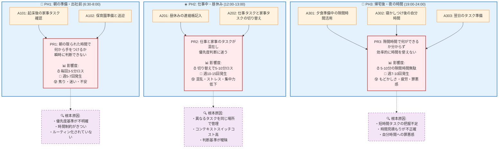

# 課題マップ（最終版）

## 課題の優先度分析

### 🔥 高優先度: PR2（仕事・家事混在課題）
- **頻度**: 週10-15回と最も高い
- **影響範囲**: 仕事効率と家事効率の両方に影響
- **解決効果**: コンテキスト分離で大幅な効率改善が期待

### 🔶 中優先度: PR1（朝の時間管理課題）
- **頻度**: 週5-7回（毎朝）
- **影響範囲**: 1日のスタートに影響、家族にも波及
- **解決効果**: ルーティン化で安定した効果

### 🔸 中優先度: PR3（隙間時間活用課題）
- **頻度**: 週7-10回
- **影響範囲**: 自分時間の確保、睡眠時間に影響
- **解決効果**: 時間の有効活用、ワークライフバランス改善

## 次のステップ

この課題マップを基に、以下のソリューション検討が可能：

1. **PR2対策**: コンテキスト分離機能（仕事モード・家事モード）
2. **PR1対策**: 朝のルーティンテンプレート機能
3. **PR3対策**: 隙間時間マッチング機能（時間×タスク）

→ `/aipm_hackathon/03_仮説駆動__ソリューションマップ` で解決策を構造化します
