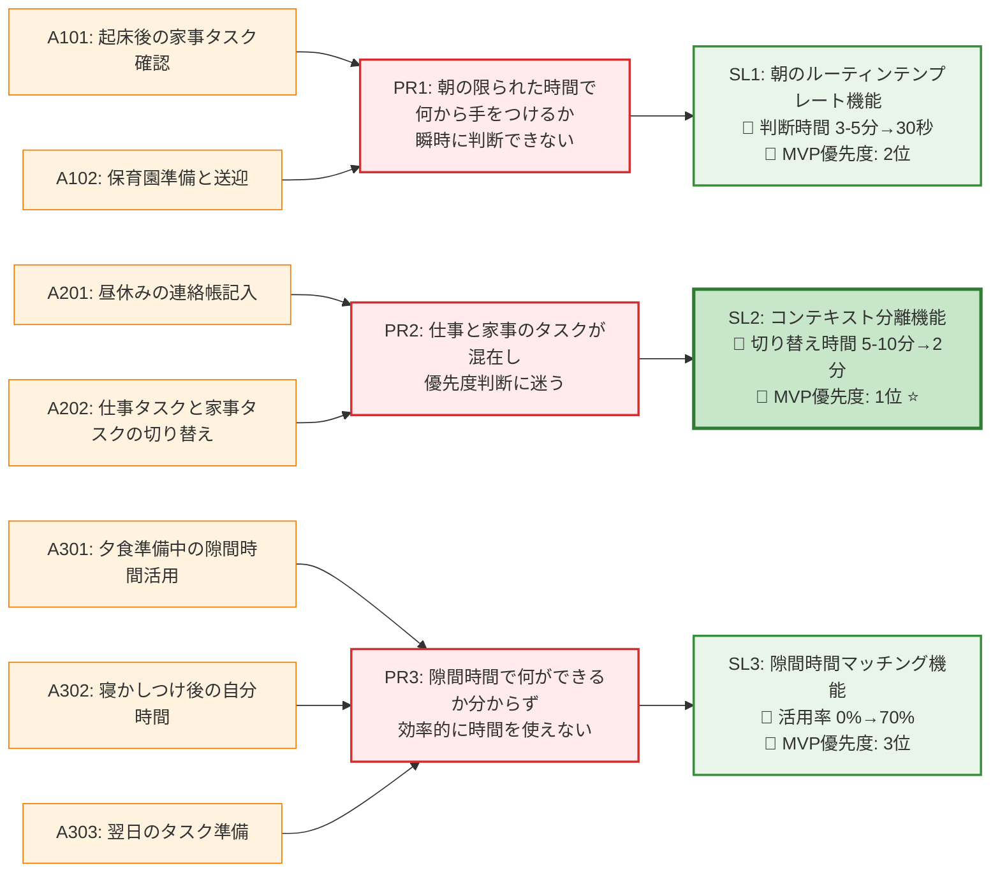

# ソリューションマップ（最終版）

## MVP開発ロードマップ

### 🥇 フェーズ1: SL2（コンテキスト分離機能）
**開発期間**: 2-3週間
**検証期間**: 2週間

**コア機能**:
- 仕事モード・家事モード切り替え
- モード別タスクフィルタリング
- 緊急度・重要度マトリックス

**成功指標**:
- コンテキストスイッチ時間50%短縮
- ユーザーストレス度30%減少
- 継続利用率80%以上

### 🥈 フェーズ2: SL1（朝のルーティンテンプレート）
**開発期間**: 1-2週間
**検証期間**: 1週間

**コア機能**:
- 時間制約対応優先度算出
- 朝の準備チェックリスト
- 忘れ物防止アラート

**成功指標**:
- 朝の準備時間20%短縮
- 忘れ物発生率50%減少
- 朝のストレス度40%減少

### 🥉 フェーズ3: SL3（隙間時間マッチング）
**開発期間**: 3-4週間
**検証期間**: 4週間

**コア機能**:
- 利用可能時間自動検出
- 時間別タスク提案
- 達成感可視化

**成功指標**:
- 隙間時間活用率70%達成
- タスク完了満足度4.0以上
- 自分時間確保感向上

## 技術実装優先度

### 高優先度（MVP必須）
1. **モード切り替え機能**: SL2のコア
2. **タスクフィルタリング**: SL2の基盤
3. **優先度算出ロジック**: SL1の核心

### 中優先度（早期追加）
4. **テンプレート機能**: SL1の拡張
5. **通知システム**: 全体の利便性向上
6. **基本的な時間管理**: SL3の準備

### 低優先度（将来拡張）
7. **カレンダー連携**: SL3の高度化
8. **機械学習による最適化**: 全体の精度向上
9. **ゲーミフィケーション**: エンゲージメント向上

## ソリューション仮説文

> **コンテキスト分離とスマートルーティン、時間マッチング機能** を提供することで、より多くの共働きママが **迷わず効率的にタスクを管理し、家族時間と自分時間を確保** できるようになると信じています。

## 次のアクション

1. **SL2プロトタイプ開発**: モード切り替えの基本機能実装
2. **ユーザーテスト準備**: 共働きママ5名のリクルーティング
3. **効果測定設計**: 定量・定性指標の詳細化
4. **技術検証**: 実装可能性とパフォーマンス確認

→ 次は `/aipm_hackathon/04_仮説駆動__ストーリーマップ` でユーザーストーリーに落とし込みます
