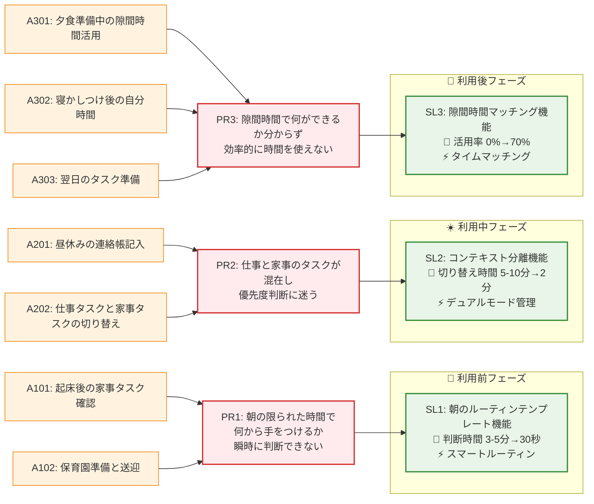

# ソリューションマップ（提案版）

## ソリューション詳細

### 🎯 SL1: 朝のルーティンテンプレート機能
- **対象課題**: PR1（朝の判断迷い）
- **コア機能**: スマートルーティン
- **主要機能**:
  - 時間制約に応じた優先度自動算出
  - 朝の準備チェックリスト
  - 忘れ物防止アラート
- **期待効果**: 判断時間 3-5分 → 30秒に短縮

### 🎯 SL2: コンテキスト分離機能
- **対象課題**: PR2（仕事・家事混在）
- **コア機能**: デュアルモード管理
- **主要機能**:
  - 仕事モード・家事モード切り替え
  - コンテキスト別タスク表示
  - 緊急度・重要度マトリックス
- **期待効果**: コンテキストスイッチ時間 5-10分 → 2分に短縮

### 🎯 SL3: 隙間時間マッチング機能
- **対象課題**: PR3（隙間時間活用不足）
- **コア機能**: タイムマッチング
- **主要機能**:
  - 利用可能時間の自動検出
  - 時間別タスク提案
  - 達成感可視化
- **期待効果**: 隙間時間活用率 0% → 70%に向上

## MVP検証の優先度提案

### 🥇 最優先: SL2（コンテキスト分離機能）
- **理由**: 最も頻度が高い課題（週10-15回）
- **検証しやすさ**: モード切り替えの効果測定が容易
- **インパクト**: 仕事効率と家事効率の両方に影響

### 🥈 次優先: SL1（朝のルーティンテンプレート機能）
- **理由**: 毎日発生する課題で効果が見えやすい
- **検証しやすさ**: 朝の準備時間の短縮を測定可能
- **インパクト**: 1日のスタートが改善されると全体に波及

### 🥉 第3優先: SL3（隙間時間マッチング機能）
- **理由**: 複雑な機能で検証に時間がかかる
- **検証しやすさ**: 効果測定が主観的になりがち
- **インパクト**: 長期的な効果は大きいが短期検証が困難
