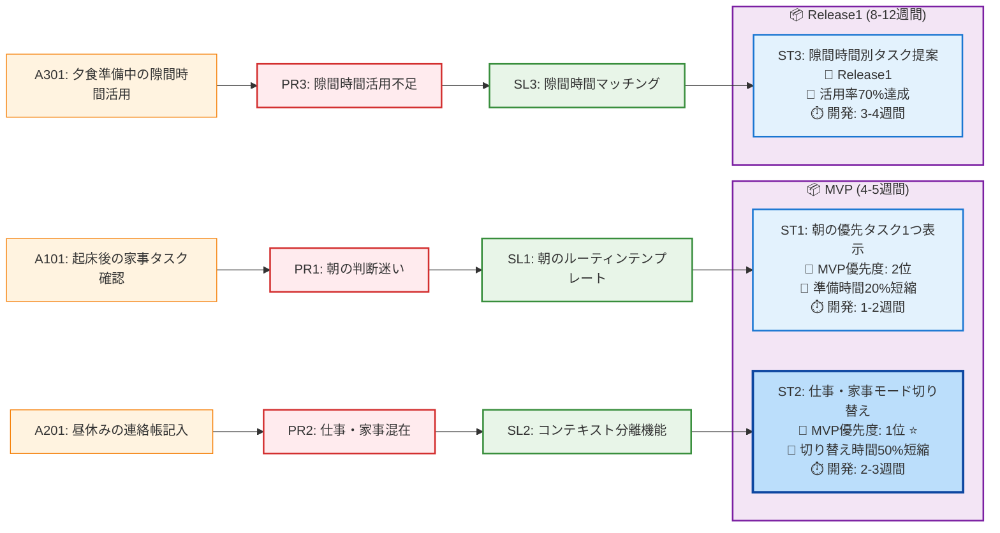

# ストーリーマップ（最終版）

## 開発ロードマップ

### 🚀 Phase 1: ST2実装（2-3週間）
**最優先ユーザーストーリー**:
> As a 共働きママ, I want 仕事モードと家事モードを切り替えて、今のコンテキストに集中したい, So that 混乱せずにタスクを効率的に処理できる

**主要機能**:
- ワンタップモード切り替え
- コンテキスト別タスクフィルタリング
- 緊急度・重要度マトリックス

**技術実装**:
- モード状態管理
- タスクカテゴリ分類
- 優先度算出ロジック

### 🚀 Phase 2: ST1統合（1-2週間）
**次優先ユーザーストーリー**:
> As a 共働きママ, I want 朝の準備で「今すぐやるべき1つのタスク」だけを表示してほしい, So that 迷わず効率的に準備を進められる

**主要機能**:
- 時間制約対応優先度算出
- 単一タスク表示
- 忘れ物防止チェックリスト

**技術実装**:
- 時間算出アルゴリズム
- テンプレート機能
- 通知システム

### 🚀 Phase 3: ST3拡張（3-4週間）
**Release1ユーザーストーリー**:
> As a 共働きママ, I want 隙間時間（5分、10分等）に応じて最適なタスクを提案してほしい, So that 短い時間も無駄にせず有効活用できる

**主要機能**:
- 時間マッチング機能
- 達成感可視化
- 活用実績記録

**技術実装**:
- カレンダー連携
- 時間見積もり機能
- 進捗可視化UI

## 受け入れ基準詳細

### ST2受け入れ基準
1. **モード切り替え**: ワンタップで仕事モード・家事モードを切り替えられる
   - 切り替えボタンが画面上部に常時表示
   - 切り替え時間は1秒以内
   - 現在のモードが視覚的に明確

2. **コンテキスト別表示**: 各モードで関連するタスクのみが表示される
   - 仕事モード: 仕事関連タスクのみ表示
   - 家事モード: 家事・育児関連タスクのみ表示
   - 無関係なタスクは非表示

3. **自動優先順位**: 緊急度・重要度に応じてタスクが自動で優先順位付けされる
   - アイゼンハワーマトリックスによる分類
   - 緊急かつ重要なタスクが最上位表示
   - 優先度の視覚的表現（色分け等）

### ST1受け入れ基準
1. **単一タスク表示**: 時間制約に応じて最優先タスクが1つだけ表示される
   - 残り時間を考慮した優先度算出
   - 1つのタスクのみを大きく表示
   - 他のタスクは非表示または最小化

2. **自動更新**: タスク完了後、次の優先タスクが自動で表示される
   - 完了ボタンタップで次タスク表示
   - 3秒以内の自動更新
   - スムーズなアニメーション

3. **忘れ物防止**: 保育園準備の忘れ物チェックリストが時間に応じて表示される
   - 出発30分前にチェックリスト表示
   - 必須アイテムの確認機能
   - 忘れ物アラート機能

### ST3受け入れ基準
1. **時間マッチング**: 利用可能時間を入力すると、その時間でできるタスクが提案される
   - 5分、10分、30分等の時間選択
   - 時間に応じた最適タスク提案
   - 提案理由の表示

2. **達成感可視化**: タスク完了時に達成感を可視化する機能がある
   - 完了時のアニメーション
   - 進捗バーの更新
   - 達成バッジの表示

3. **実績記録**: 隙間時間の活用実績が記録・表示される
   - 日別・週別の活用率グラフ
   - 完了タスク数の記録
   - 時間効率の可視化

## 成功指標とKPI

### 定量指標
- **ST2**: コンテキストスイッチ時間50%短縮（10分→5分）
- **ST1**: 朝の準備時間20%短縮（30分→24分）
- **ST3**: 隙間時間活用率70%達成
- **全体**: ユーザー継続利用率80%以上

### 定性指標
- ユーザーストレス度30%減少
- タスク管理満足度4.0以上（5点満点）
- 家族時間確保実感の向上
- 自分時間確保実感の向上

## 次のアクション

1. **ST2プロトタイプ開発**: モード切り替えの基本機能実装
2. **ユーザビリティテスト**: 共働きママ5名での操作性検証
3. **フィードバック収集**: 使いやすさと効果の確認
4. **ST1機能統合**: 朝のルーティン機能の追加実装
5. **MVP完成**: 2機能統合版のリリース準備

→ 次は画面設計で具体的なUIに落とし込みます！
