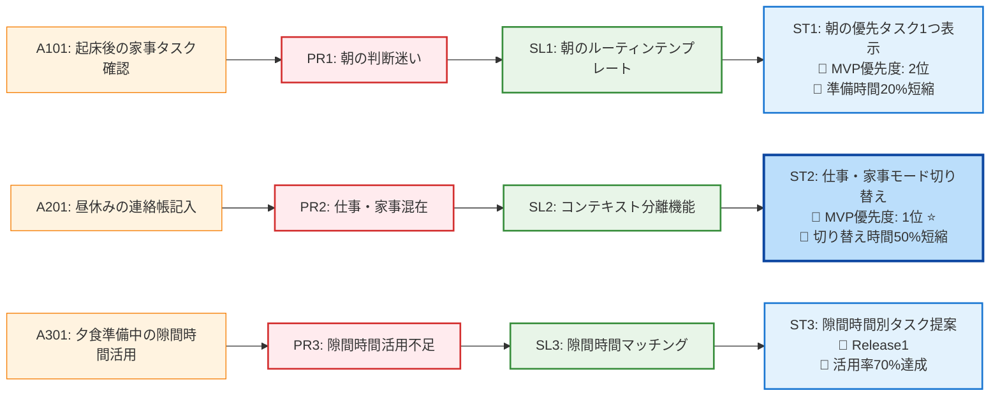

# ストーリーマップ（提案版）

## MVP実装順序

### 🥇 ST2: 仕事・家事モード切り替え（最優先）
**ユーザーストーリー**:
> As a 共働きママ, I want 仕事モードと家事モードを切り替えて、今のコンテキストに集中したい, So that 混乱せずにタスクを効率的に処理できる

**受け入れ基準**:
- ✅ ワンタップで仕事モード・家事モードを切り替えられる
- ✅ 各モードで関連するタスクのみが表示される
- ✅ 緊急度・重要度に応じてタスクが自動で優先順位付けされる

**開発見積もり**: 2-3週間
**検証期間**: 2週間

### 🥈 ST1: 朝の優先タスク1つ表示（次優先）
**ユーザーストーリー**:
> As a 共働きママ, I want 朝の準備で「今すぐやるべき1つのタスク」だけを表示してほしい, So that 迷わず効率的に準備を進められる

**受け入れ基準**:
- ✅ 時間制約（残り時間）に応じて最優先タスクが1つだけ表示される
- ✅ タスク完了後、次の優先タスクが自動で表示される
- ✅ 保育園準備の忘れ物チェックリストが時間に応じて表示される

**開発見積もり**: 1-2週間
**検証期間**: 1週間

### 🥉 ST3: 隙間時間別タスク提案（Release1）
**ユーザーストーリー**:
> As a 共働きママ, I want 隙間時間（5分、10分等）に応じて最適なタスクを提案してほしい, So that 短い時間も無駄にせず有効活用できる

**受け入れ基準**:
- ✅ 利用可能時間を入力すると、その時間でできるタスクが提案される
- ✅ タスク完了時に達成感を可視化する機能がある
- ✅ 隙間時間の活用実績が記録・表示される

**開発見積もり**: 3-4週間
**検証期間**: 4週間

## リリース計画

### 📦 MVP（4-5週間）
- **含まれるストーリー**: ST2 + ST1
- **成功指標**:
  - コンテキストスイッチ時間50%短縮
  - 朝の準備時間20%短縮
  - ユーザー継続利用率80%以上

### 📦 Release1（8-12週間）
- **含まれるストーリー**: ST3
- **成功指標**:
  - 隙間時間活用率70%達成
  - タスク完了満足度4.0以上

## 技術実装の複雑度

| ストーリー | 開発工数 | 検証複雑度 | ユーザー影響 | 優先度 |
|-----------|---------|-----------|-------------|--------|
| ST2 | 中 | 低 | 高 | 🥇 |
| ST1 | 中 | 低 | 中 | 🥈 |
| ST3 | 高 | 高 | 中 | 🥉 |
